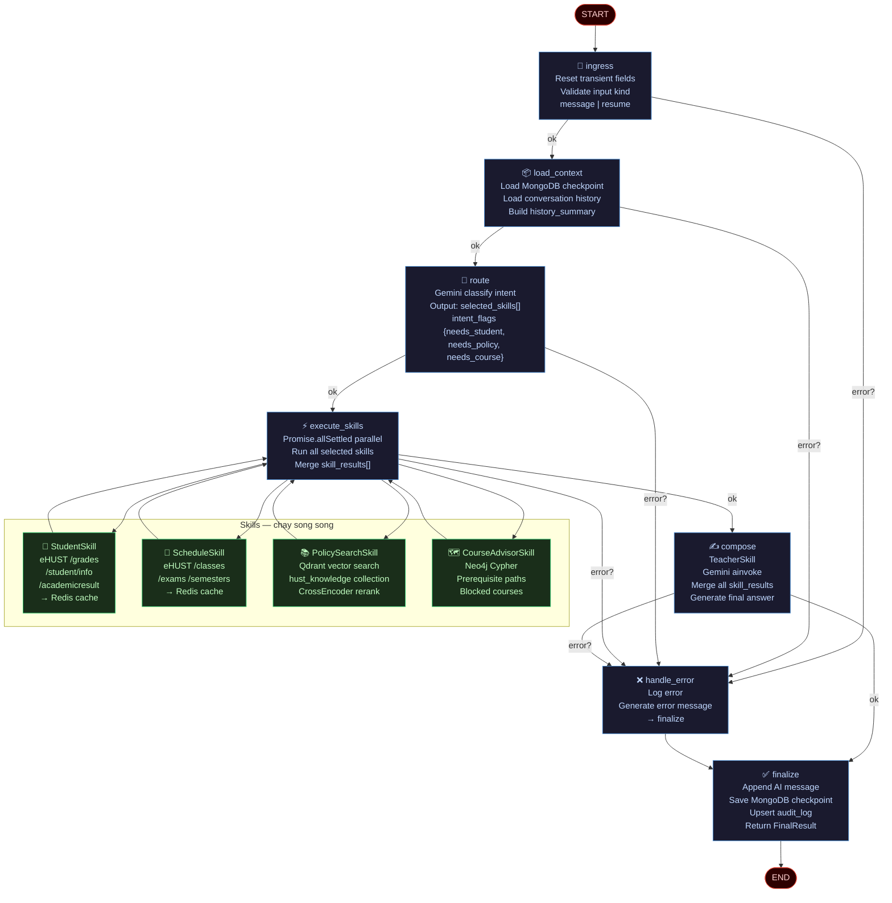

# [D1] LangGraph Flow — HustVA V3

> Adapted từ `aivoice-agent-clone`. Thay đổi chính: `execute_skills` chạy song song nhiều skill.

## Graph Flow



---

## Node Responsibilities

| Node | Input từ State | Output vào State |
|---|---|---|
| `ingress` | messages[-1] | Reset: selected_skills=[], skill_results=[], error=null |
| `load_context` | thread_id (config) | history_summary, student_context (từ cache) |
| `route` | messages[-1], history_summary | selected_skills[], intent_flags, routing metadata |
| `execute_skills` | selected_skills[], student_id | skill_results[] (1 per skill) |
| `compose` | skill_results[], messages | draft_answer, citations |
| `finalize` | draft_answer, citations | final_text, messages append AI msg |
| `handle_error` | error | draft_answer = error message |

---

## Conditional Edges

```typescript
// Sau mỗi node — nếu có lỗi → handle_error
function globalErrorGuard(state, defaultNext) {
  return state.error ? 'handle_error' : defaultNext;
}

// Route từ execute_skills
function afterExecuteSkills(state) {
  if (state.error) return 'handle_error';
  return 'compose'; // không có interrupt trong HustVA v3
}
```

---

## So sánh với aivoice-agent-clone

| Điểm | aivoice-agent-clone | HustVA V3 |
|---|---|---|
| `route` output | `selected_skill: string` | `selected_skills: string[]` |
| `execute_skill` | Gọi 1 skill | `Promise.allSettled` nhiều skill |
| `wait_external` | Có (interrupt) | **Không có** (HustVA không cần human handoff) |
| `apply_resume` | Có | **Không có** |
| `compose` | Node riêng | Vẫn là node riêng (TeacherSkill) |
