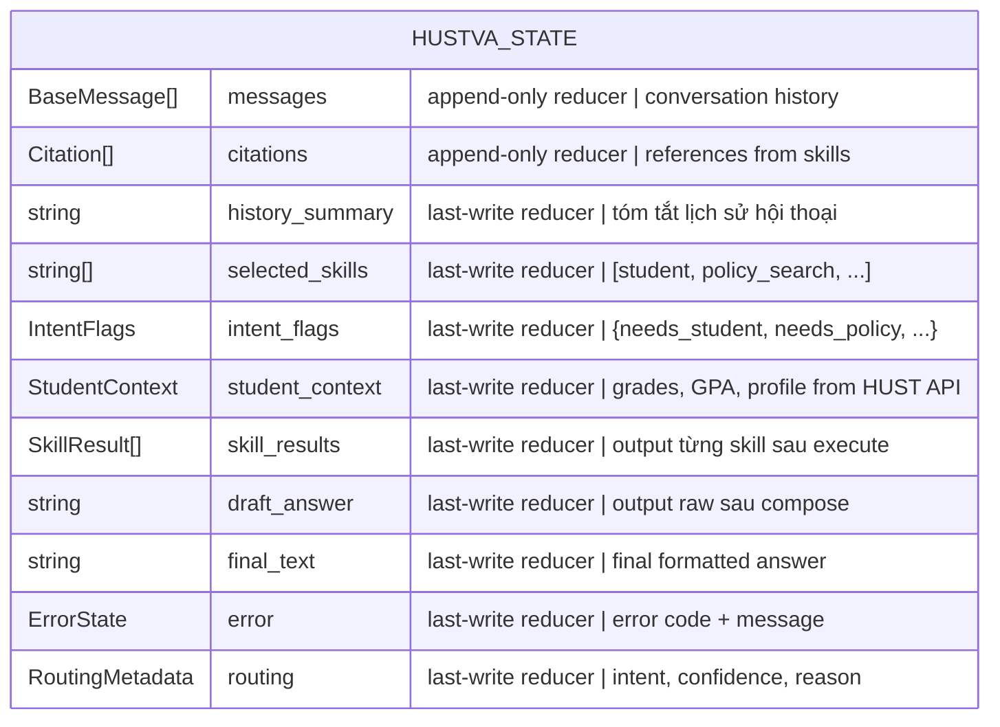

# [D2] State Annotation — HustVA V3

> Mở rộng từ aivoice-agent-clone `StateAnnotation`. Thêm 4 fields cho HustVA multi-skill context.

## State Schema



## TypeScript Types

```typescript
// skills/types.ts
export type SkillResult = {
  skill: string;
  success: boolean;
  data?: Record<string, unknown>;
  error?: string;
};

export type IntentFlags = {
  needs_student: boolean;    // cần thông tin SV từ HUST API
  needs_schedule: boolean;   // cần TKB hoặc lịch thi
  needs_policy: boolean;     // cần tìm kiếm quy chế (Qdrant)
  needs_course_graph: boolean; // cần tư vấn môn học (Neo4j)
};

export type StudentContext = {
  studentId: string;
  fullName: string;
  program: string;
  programId: string;
  school: string;
  schoolId: number;
  status: string;
  currentSemester?: string;
  gpa?: number;
  cpa?: number;
  grades?: GradeRecord[];
  warningLevel?: number;     // từ /academicresult: level field
};

export type GradeRecord = {
  classId: string;
  courseId: string;
  courseName?: string;
  semester: string;
  examMark: number;          // -1.0 = chưa thi
  processMark: number;
  finalMarkLetter: string;   // "" = đang học
};

export type Citation = {
  source: 'kb' | 'hust_api' | 'neo4j';
  id: string;
  title?: string;
  section?: string;          // từ Qdrant payload.section
  link?: string;             // từ Qdrant payload.link
};

export type ErrorState = {
  code: 'INVALID_INPUT' | 'SKILL_FAILED' | 'LLM_ERROR' | 'INTERNAL';
  message: string;
  where?: string;
};

export type RoutingMetadata = {
  intent?: string;
  confidence?: number;
  reason?: string;
};
```

## State Annotation Definition

```typescript
// graph/graph/state.ts
import { Annotation } from '@langchain/langgraph';
import { BaseMessage } from '@langchain/core/messages';

export const StateAnnotation = Annotation.Root({
  // ── Conversation ──────────────────────────────
  messages: Annotation<BaseMessage[]>({
    reducer: (x, y) => x.concat(y),
    default: () => [],
  }),
  history_summary: Annotation<string>({
    reducer: (x, y) => y ?? x,
    default: () => '',
  }),

  // ── Routing ───────────────────────────────────
  selected_skills: Annotation<string[]>({
    reducer: (_, y) => y,
    default: () => [],
  }),
  intent_flags: Annotation<IntentFlags | null>({
    reducer: (_, y) => y,
    default: () => null,
  }),
  routing: Annotation<RoutingMetadata | null>({
    reducer: (_, y) => y,
    default: () => null,
  }),

  // ── Skill data ────────────────────────────────
  student_context: Annotation<StudentContext | null>({
    reducer: (_, y) => y,
    default: () => null,
  }),
  skill_results: Annotation<SkillResult[]>({
    reducer: (_, y) => y,
    default: () => [],
  }),
  citations: Annotation<Citation[]>({
    reducer: (x, y) => x.concat(y),
    default: () => [],
  }),

  // ── Output ────────────────────────────────────
  draft_answer: Annotation<string | null>({
    reducer: (_, y) => y,
    default: () => null,
  }),
  final_text: Annotation<string | null>({
    reducer: (_, y) => y,
    default: () => null,
  }),

  // ── Error ─────────────────────────────────────
  error: Annotation<ErrorState | null>({
    reducer: (_, y) => y,
    default: () => null,
  }),
});
```

## Thay đổi so với aivoice-agent-clone

| Field | aivoice-agent-clone | HustVA V3 | Lý do |
|---|---|---|---|
| `selected_skill` | string (1 skill) | **`selected_skills: string[]`** | Multi-skill parallel |
| `pending_action` | PendingAction | **Xóa** | Không cần human handoff |
| `resume_value` | unknown | **Xóa** | Không cần interrupt/resume |
| `action_result` | string | **Xóa** | Không cần |
| `student_context` | — | **Thêm** | Cache SV context in-state |
| `intent_flags` | — | **Thêm** | Explicit intent flags |
| `skill_results` | — | **Thêm** | Multi-skill merge |
| `citations.source` | `kb` / `product_api` | **`kb` / `hust_api` / `neo4j`** | Đúng nguồn |
