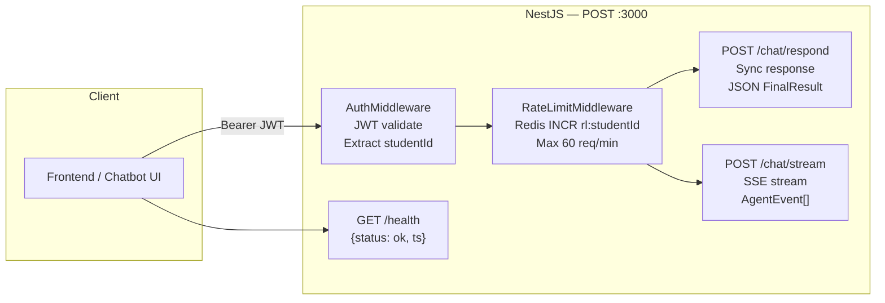

# [D4] REST API Design — HustVA V3

> NestJS server layer. Adapted từ aivoice-agent-clone `server/`.

## Endpoints



---

## Request / Response DTOs

### POST `/chat/respond`

**Request:**
```typescript
class ChatRespondDto {
  thread_id: string;        // UUID — conversation thread
  student_id: string;       // MSSV từ JWT claim hoặc body
  message: string;          // Câu hỏi của sinh viên
  options?: {
    trace?: boolean;         // Langfuse tracing on/off
    locale?: 'vi' | 'en';   // default 'vi'
  };
}
```

**Response (200):**
```typescript
class ChatRespondResponseDto {
  run_id: string;
  thread_id: string;
  status: 'completed' | 'error';
  assistant?: {
    text: string;
    citations?: Citation[];  // [{source, title, section, link}]
  };
  error?: {
    code: string;
    message: string;
  };
  meta: {
    latency_ms: number;
    skills_used: string[];   // ["student", "policy_search"]
    intent: string;
  };
}
```

---

### POST `/chat/stream`

**Request:** Same as `/chat/respond`

**Response:** SSE stream

```typescript
// Event types (AgentEvent)
type AgentEvent =
  | { type: 'run.started';   run_id, thread_id, ts, seq }
  | { type: 'message.delta'; delta: string, node: string, seq }
  | { type: 'run.completed'; status, skills_used, seq }
  | { type: 'run.failed';    error: {code, message}, seq };
```

**SSE example:**
```
data: {"type":"run.started","run_id":"req-123","thread_id":"th-456","seq":1}

data: {"type":"message.delta","delta":"Theo Điều 38 Quy chế đào tạo,","seq":2}

data: {"type":"message.delta","delta":" em đang ở mức cảnh cáo lần 1.","seq":3}

data: {"type":"run.completed","status":"completed","skills_used":["student","policy_search"],"seq":12}
```

---

### GET `/health`

```json
{
  "status": "ok",
  "ts": "2026-02-28T21:00:00.000Z",
  "version": "3.0.0",
  "services": {
    "mongodb": "connected",
    "qdrant": "connected",
    "neo4j": "connected",
    "redis": "connected"
  }
}
```

---

## Middleware Stack

```
Request
   ↓
AuthMiddleware         — JWT validate → extract {studentId, role}
   ↓
RateLimitMiddleware    — Redis INCR rl:{studentId} → if ≥ 60: 429
   ↓
Controller             — ChatController.respond() / .stream()
   ↓
ChatService            — facade.invoke() / facade.stream()
   ↓
AgentFacade            — LangGraph graph execution
   ↓
Response
```

---

## AgentConfig (passed via `configurable`)

```typescript
// Passed to graph.invoke(payload, { configurable: ... })
type AgentRuntimeConfig = {
  thread_id: string;
  student_id: string;       // HUST MSSV — dùng để gọi eHUST API
  request_id: string;       // UUID per request
  options?: {
    locale?: 'vi' | 'en';
    trace?: boolean;
  };
};
```

---

## Error Codes

| HTTP | Code | Meaning |
|---|---|---|
| 400 | `INVALID_INPUT` | Missing thread_id hoặc message |
| 401 | `UNAUTHORIZED` | JWT invalid hoặc expired |
| 429 | `RATE_LIMITED` | Vượt 60 req/min |
| 500 | `INTERNAL` | Unhandled error trong graph |
| 503 | `SKILL_FAILED` | Tất cả skills failed (eHUST down) |
