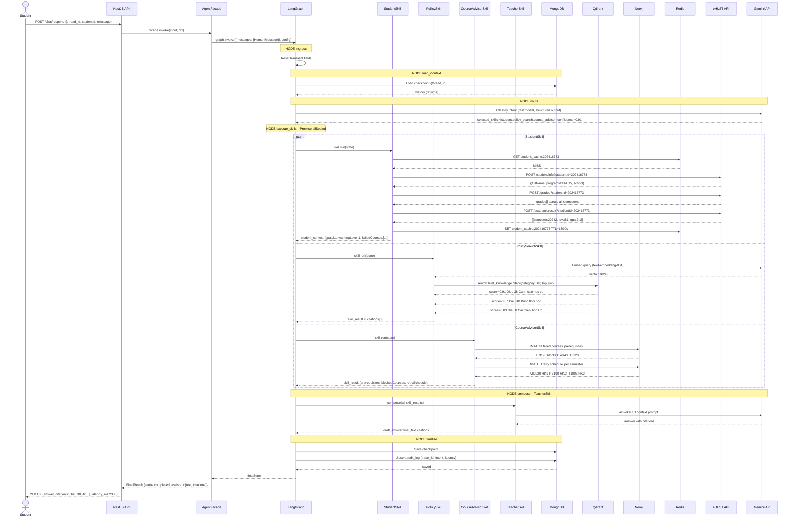
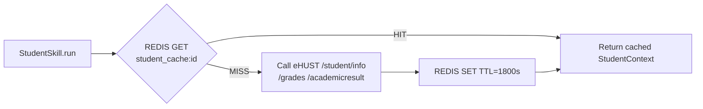
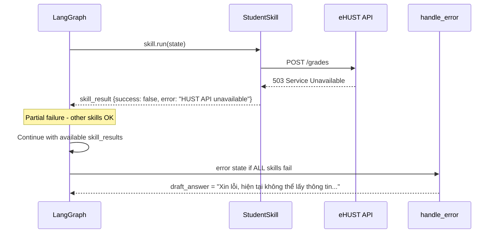

# [D5] Sequence Diagram — HustVA V3

> Use case: "Em bị cảnh cáo học vụ, quy định xử lý sao? Cần học lại những môn nào?"
> Multi-skill: student + policy_search + course_advisor chạy parallel



---

## Event Stream (SSE mode — /chat/stream)

```
run.started       → {run_id, thread_id, ts}
message.delta     → {delta: "Theo Điều 38..."} × N  (streaming tokens)
message.delta     → {delta: "...cần học lại MI2020"}
run.completed     → {status: "completed"}
```

---

## Redis Cache Flow — StudentSkill



---

## Error Flow


